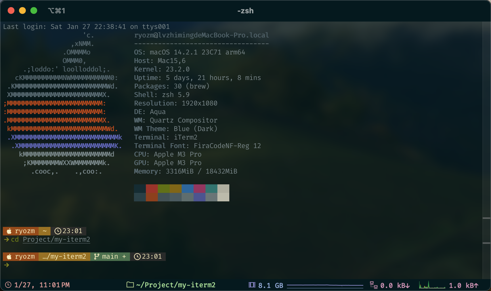

# my-iterm2
My iterm2 configuration steps

[English](README.md) | [简体中文](README.zh.md)

## Screenshots


## Prerequisites
System: macOS
1. git (macos has git installed by default)
2. zsh (macos has zsh installed by default)

## Get started

### Install Nerd Fonts
1. Download Nerd Fonts from [here](https://www.nerdfonts.com/font-downloads) (I use FiraCode Nerd Font)
2. Install Nerd Fonts

### Install iTerm2
1. Download iTerm2 from [here](https://www.iterm2.com/)
2. Install iTerm2
3. Set iTerm2 font to Nerd Fonts
  ```bash
  # 1. Open iTerm2
  # 2. Open Preferences (⌘ + ,)
  # 3. Go to Profiles -> Text
  # 4. Change Font to Nerd Fonts
  ```
4. Set iTerm2 color scheme to the one in this repo (my-iterm2/iterm2-color-scheme.itermcolors)
  ```bash
  # 1. Open iTerm2
  # 2. Open Preferences (⌘ + ,)
  # 3. Go to Profiles -> Colors
  # 4. Click on Color Presets... -> Import...
  # 5. Select the iterm2-color-scheme.itermcolors file
  # 6. Select the imported color scheme
  ```
5. Enabled status bar
  ```bash
  # 1. Open iTerm2
  # 2. Open Preferences (⌘ + ,)
  # 3. Go to Profiles -> Session
  # 4. Check Status bar enabled
  # 5. Click Configure Status Bar...
  # 6. Choose the components you want to display
  ```
6. Set iTerm2 appearance
  ```bash
  # 1. Open iTerm2
  # 2. Open Preferences (⌘ + ,)
  # 3. Go to Appearance -> General
  # 4. set Theme to Minimal
  # 5. set Tab bar location to Top
  # 6. set Status bar location to Bottom
  ```

### Install oh-my-zsh and plugins(zsh-autosuggestions, zsh-syntax-highlighting)
1. Install oh-my-zsh from [here](https://ohmyz.sh/#install)
  ```bash
  # quick install
  sh -c "$(curl -fsSL https://raw.githubusercontent.com/ohmyzsh/ohmyzsh/master/tools/install.sh)"
  ```
2. Install zsh-autosuggestions from [here](https://github.com/zsh-users/zsh-autosuggestions/blob/master/INSTALL.md)
  ```bash
  # 1. Clone this repository in oh-my-zsh's plugins directory:
  git clone https://github.com/zsh-users/zsh-autosuggestions ${ZSH_CUSTOM:-~/.oh-my-zsh/custom}/plugins/zsh-autosuggestions
  # 2. Add the plugin to the list of plugins for Oh My Zsh to load (inside ~/.zshrc):
  plugins=( 
    # other plugins...
    zsh-autosuggestions
  )
  # 3. Restart your shell
  ```
3. Install zsh-syntax-highlighting from [here](https://github.com/zsh-users/zsh-syntax-highlighting/blob/master/INSTALL.md)
  ```bash
  # 1. Clone this repository in oh-my-zsh's plugins directory:
  git clone https://github.com/zsh-users/zsh-syntax-highlighting.git ${ZSH_CUSTOM:-~/.oh-my-zsh/custom}/plugins/zsh-syntax-highlighting
  # 2. Add the plugin to the list of plugins for Oh My Zsh to load (inside ~/.zshrc):
  plugins=( 
    # other plugins...
    zsh-syntax-highlighting
  )
  # 3. Restart your shell
  ```


### Install Starship
1. Install Starship from [here](https://starship.rs/guide/#%F0%9F%9A%80-installation)
  ```bash
  # 1. Install with Shell:
  sh -c "$(curl -fsSL https://starship.rs/install.sh)"
  # 2. Add the init script to your shell's config file:
  # Zsh
  echo 'eval "$(starship init zsh)"' >> ~/.zshrc
  ```
2. Configure Starship
  ```bash
  # 1. Create the config directory if it doesn't already exist:
  mkdir -p ~/.config
  # 2. Replace the starship.toml file with the one in this repo (my-iterm2/starship.toml)
  mv my-iterm2/starship.toml ~/.config/starship.toml
  # 3. Restart your shell
  ```

### Install neofetch
Need to install homebrew first from [here](https://brew.sh/)
```bash
# Need to install homebrew first 

# 1. Install neofetch
brew install neofetch
# 2. Add neofetch to zshrc
echo 'neofetch' >> ~/.zshrc
# 3. Restart your shell
```

## References
1. [iTerm2](https://www.iterm2.com/)
2. [oh-my-zsh](https://ohmyz.sh/)
3. [zsh-autosuggestions](https://github.com/zsh-users/zsh-autosuggestions)
4. [zsh-syntax-highlighting](https://github.com/zsh-users/zsh-syntax-highlighting)
5. [Starship](https://starship.rs/)
6. [neofetch](https://github.com/dylanaraps/neofetch)
7. [FiraCode Nerd Font](https://www.nerdfonts.com/font-downloads)

## License
[MIT](LICENSE)